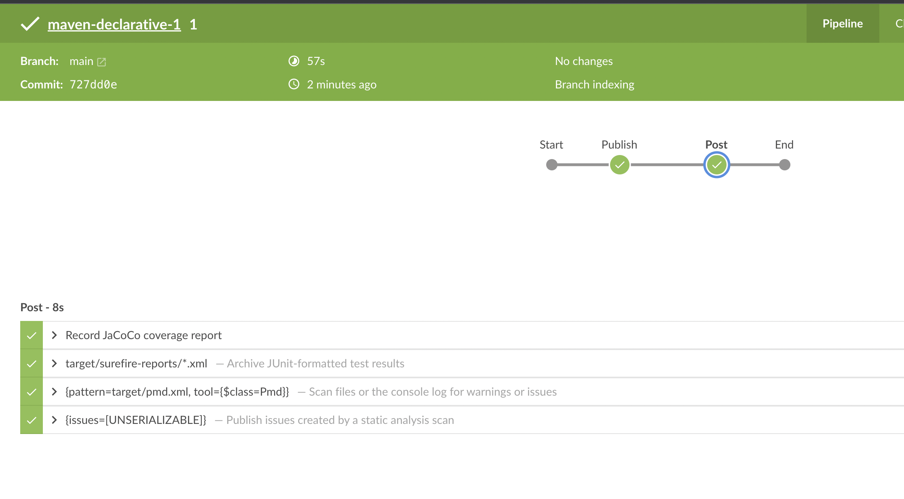
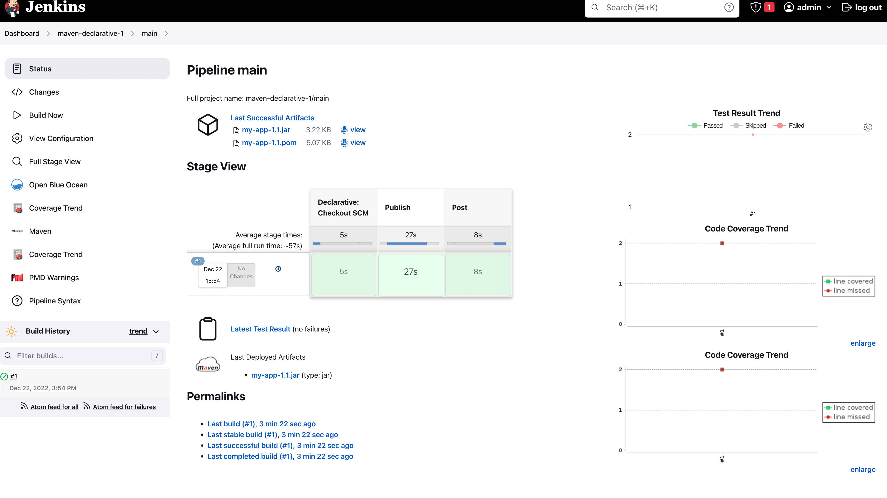
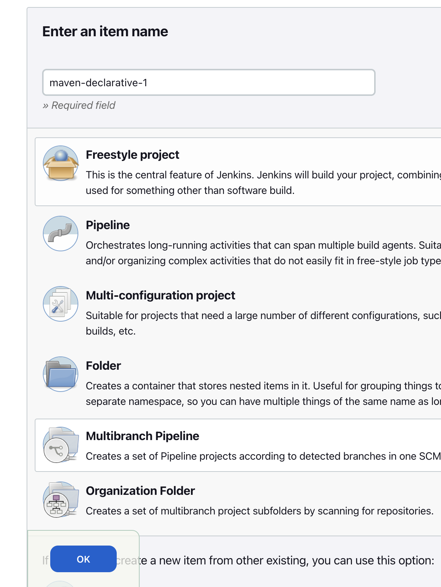
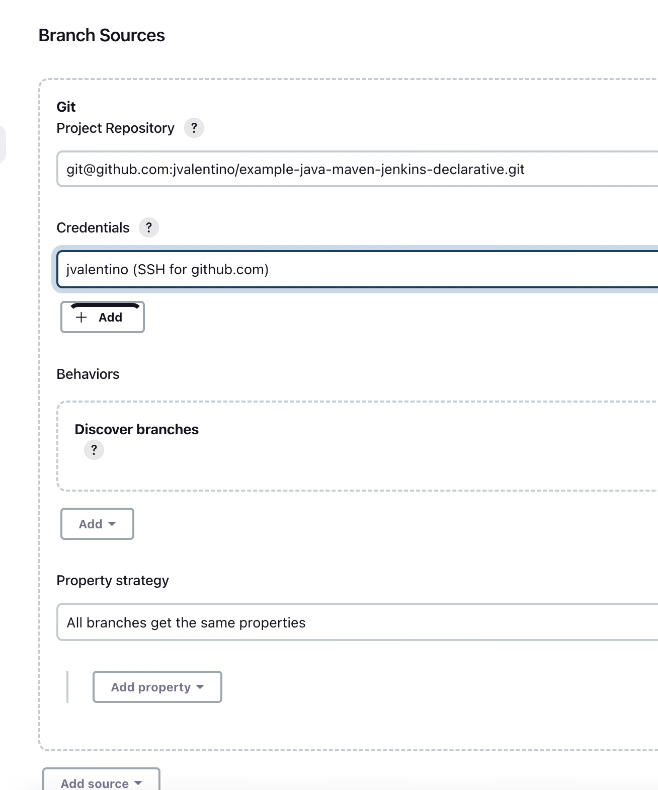

# Using a Scripted Pipeline to deliver Java Libraries with Maven

Prerequisites

- Git Setup: https://github.com/jvalentino/setup-git
- Having setup Docker and Docker Compose: https://github.com/jvalentino/setup-docker
- Local Jenkins: https://github.com/jvalentino/example-docker-jenkins
- Building Java 101: https://github.com/jvalentino/java-building-101
- Maven-Java Part 1: https://github.com/jvalentino/example-java-maven-lib-1
- Maven-Java Part 2: https://github.com/jvalentino/example-java-maven-lib-2
- Maven-Java Part 3: https://github.com/jvalentino/example-java-maven-lib-3
- Maven-Java Part 4: https://github.com/jvalentino/example-java-maven-lib-4
- Jenkins Freestyle: https://github.com/jvalentino/example-java-maven-jenkins-freestyle

# (1) Plugins

## Pipeline Maven



## Blue Ocean



# (2) The Pipeline as Code

```groovy
node {
  
  stage('Clone') {
      dir('.') {
          git branch: 'main', credentialsId: 'github_com', url: 'git@github.com:jvalentino/example-java-maven-jenkins-scripted.git'
      }    
  }       

  stage('Deploy') {
     withCredentials([usernamePassword(
        credentialsId: 'github-publish-maven', 
        passwordVariable: 'MVN_PASSWORD', 
        usernameVariable: 'MVN_USERNAME')]) {

        withMaven(mavenSettingsFilePath: 'settings.xml') {
          sh """
            ./mvnw deploy \
                -Drepo.id=github \
                -Drepo.login=${MVN_USERNAME} \
                -Drepo.pwd=${MVN_PASSWORD} \
                -Drevision=1.${BUILD_NUMBER}
          """
        }  
     }
  }  

  stage('Post') {
    jacoco()
    junit 'target/surefire-reports/*.xml'
    def pmd = scanForIssues tool: [$class: 'Pmd'], pattern: 'target/pmd.xml'
    publishIssues issues: [pmd]
  }
  
}
```

# (3) Setup






# (4) Runtime


